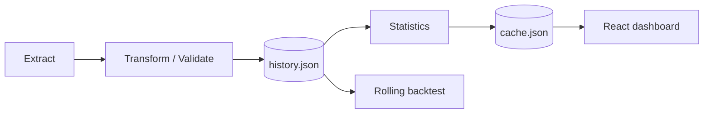

# Historical Event Analysis

A reproducible, JSON-backed TypeScript platform for analysing fixed-format historical events. It is designed for statistics, time-series exploration, algorithm benchmarking, and leakage-free rolling backtests — not production prediction.

## Quick start

```powershell
npm.cmd install
npm.cmd run check
npm.cmd run dev
```

The dashboard reads `data/cache.json`. Use `SynchronizationService` to ingest records; it validates against the configured `EventRules`, writes `history.json` as the single source of truth, and regenerates metadata plus cache.

To explore the dashboard without real data, create 120 deterministic, explicitly labelled demo events:

```powershell
npm.cmd run seed:demo
```

This command refuses to run when `history.json` already contains records, so it will not overwrite imported data.

## Architecture



`src/core` contains domain types and errors. `src/database` owns atomic JSON persistence and repositories. `src/sync` owns validation and orchestration. `src/statistics` is deterministic analysis. `src/backtest` holds independent algorithms and the rolling evaluator. `src/dashboard` is read-only and consumes cache.

## Event format

```json
{"drawId":"D-001","date":"2026-01-01","timestamp":"2026-01-01T12:00:00.000Z","mainNumbers":[1,2,3,4,5,6],"specialNumber":7,"validation":{"source":"import","validatedAt":"2026-01-01T12:01:00.000Z","schemaVersion":"1"}}
```

Adjust `defaultRules` in `src/sync/synchronization-service.ts` to match the target dataset. Invalid records (including duplicate draw IDs, repeated numbers, malformed dates, wrong count, or range violations) are rejected without corrupting history.

## Real Mega 6/45 historical data

`npm.cmd run crawl:mega645` backfills the historical Mega 6/45 results from the public [Minh Ngọc results archive](https://www.minhngoc.net.vn/ket-qua-xo-so/dien-toan-vietlott/mega-6x45.html), pauses between requests, deduplicates by draw ID, and refreshes the cache. The source URL is recorded in each event. Mega 6/45 has no bonus ball, so `specialNumber` is the documented sentinel `0`.

## Netlify deployment

Netlify uses `netlify.toml` to build `dist` and deploy the `netlify/functions/dashboard.ts` serverless function. The dashboard requests `/api/dashboard` on every load. The function checks the latest public Lottto 5/35 source, merges the returned draws with the deployed history, rebuilds the statistics in memory, and returns `Cache-Control: no-store`; it falls back safely to the deployed history if the external source is unavailable.

## Backtesting

`RollingBacktest` trains strictly on events before each evaluated event and never exposes future records. Register independent `Algorithm` factories in `AlgorithmRegistry`; the included frequency strategy demonstrates the contract.
